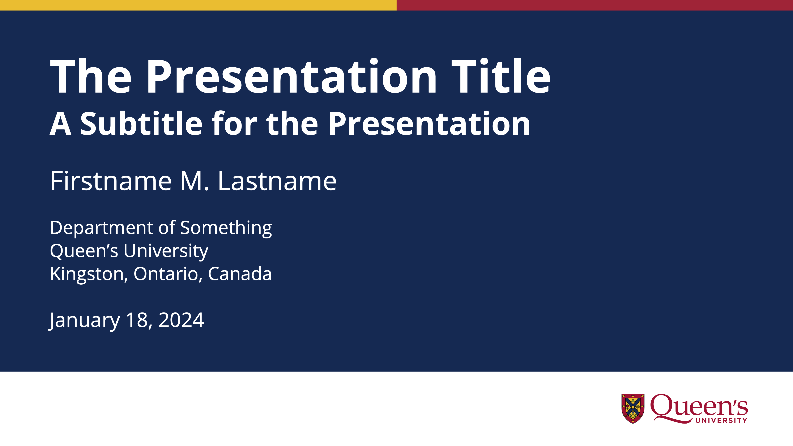
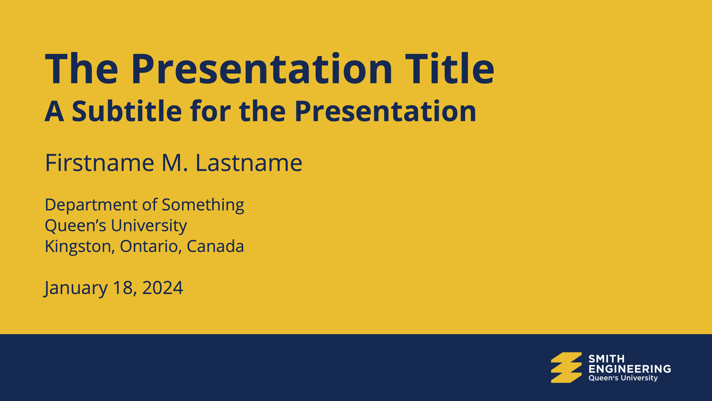

# qu-slides: LaTeX Beamer Class and Presentation Template for Queen's University

This template provides a simple and clean [LaTeX Beamer](https://ctan.org/pkg/beamer) class to approximately look like the [visual identity](https://www.queensu.ca/brand-central/) standard for [Queen’s University](http://www.queensu.ca) at Kingston, Ontario, Canada. It also includes templates for [Smith Engineering](https://smithengineering.queensu.ca) themed slides.

This LaTeX template is particularly useful for technical presentations involving maths and code snippets.  Embedded video is also supported (but only works for some PDF viewers). If you use MacOS, [SlidePilot](https://slidepilotapp.com/en/) works well and has a presenter view with notes.

## Example Output

See the [example PDF output](qu-slides-example.pdf) included in this repository for examples of all slide types.  Two example title slides are shown below.




## Dependencies

This template requires a number of packages, each loaded in the [qu-slides.cls](qu-slides.cls) file.  Most notably, the Queen's standard font is the free font [Open Sans](https://fonts.google.com/specimen/Open+Sans), which this template incorporates by using the [opensans package](https://tug.org/FontCatalogue/opensans/).

### Embedded Video

An example video is not included in this repository.  However, the code snippet below provides an example of how to create a slide where a video (e.g., an MP4 downloaded from YouTube) might be embedded in a slide.

```latex
\SlideBlack
\setbeamercolor{background canvas}{bg=black}
\begin{frame}

    \hspace*{-1.1cm}
    \movie[width=\paperwidth, height=0.5625\paperwidth]{}{vids/video-file.mp4}

\end{frame}
```

### Code and Syntax Highlighting

This template includes functionality for syntax highlighting of code snippets using the [minted](https://www.ctan.org/pkg/minted) package.  Overleaf has a nice [introduction to minted](https://www.overleaf.com/learn/latex/Code_Highlighting_with_minted).

Minted requires the installation of additional software, Pygments.  Section 2.1 of [the minted documentation](https://mirror.csclub.uwaterloo.ca/CTAN/macros/latex/contrib/minted/minted.pdf) describes how to install Pygments.  If you use macOS, the easiest way is probably to just [install Pygments using Homebrew](https://formulae.brew.sh/formula/pygments#default).

When running LaTeX and using minted, you must invoke it with the `-shell-escape` flag so that it can access Pygments.  For example, if you are using Visual Studio Code as an IDE with the LaTeX Workshop extension and compile your document using `latexmk`, then you can edit the `settings.json` file to include the flag, as shown in the example snippet below.

```json
"latex-workshop.latex.tools":[
    {
        "name": "latexmk",
        "command": "latexmk",
        "args": [
            "-shell-escape",
            "-synctex=1",
            "-interaction=nonstopmode",
            "-file-line-error",
            "-pdf",
            "-outdir=%OUTDIR%",
            "%DOC%"
        ],
        "env": {}
    },
```

If you do not need this functionality, then you can simply comment out these lines shown below in the [qu-slides.cls](qu-slides.cls) file and be sure to not use minted commands in your document.

```latex
% For code snippets in your slides
\RequirePackage{minted}
\setminted[python]{linenos=true}
\setminted[cpp]{linenos=true}
\renewcommand\theFancyVerbLine{\sffamily\scriptsize\arabic{FancyVerbLine}}
```

## Contact the Author

[Joshua Marshall](https://offroad.engineering.queensu.ca/people/joshua-marshall/), PhD, PEng  
[Department of Electrical and Computer Engineering](https://www.ece.queensu.ca)  
[Queen's University](http://www.queensu.ca)  
Kingston, ON K7L 3N6 Canada  
+1 (613) 533-2921  
[joshua.marshall@queensu.ca](mailto:joshua.marshall@queensu.ca)

## License

The code associated with this class and template is subject to an [MIT License](LICENSE).
